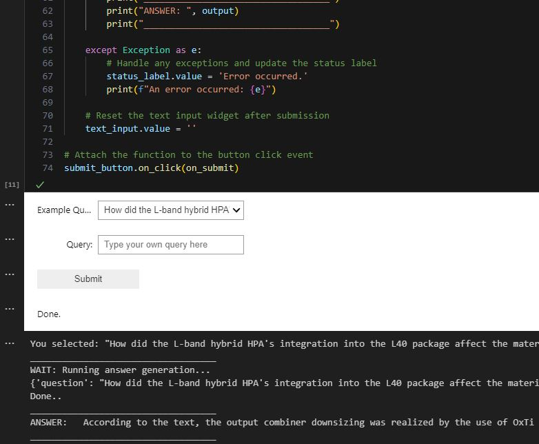
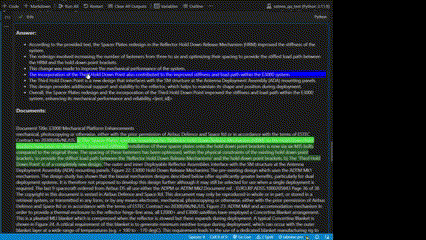

# ESA Document QA 

This project provides tools for question-answering on ESA final report documents.

## Requirements

- Linux OS
- At least 8GB of random access memory (RAM) available (GPU recommended)
- Python 3.11 installation


## Installation

Clone the repository:

```sh
git clone https://github.com/PaulDrm/satnex_document_qa
cd satnex_document_qa
```

Install the required Python packages into new environment:

```sh
pip install -r requirements.txt
```

## Setup

- Insert ESA final report documents in folder "./datasets/esa_documents/"
- Run "preprocess_esa_documents.sh" 

## Running QA 

- open "qa_notebook.ipynb" and follow instructions there

### Load different LLM Models

- **Device Selection**: Specify `device` as either 'cpu', 'cuda' (for GPU), or `None` for self-selection.
- **Model Specification**: 
  - To specify a specific model, use the link to the Hugging Face repository:
    - Example for CPU model: 
      ```
      model = rag_llm_classes.load_inference_model(model_name='QuantFactory/Meta-Llama-3.1-8B-Instruct-GGUF', file name="Meta-Llama-3.1-8B-Instruct.Q5_K_M.gguf", device='cpu')
      ```
    - Example for GPU model:
      ```
      model = rag_llm_classes.load_inference_model(model_name='Nexusflow/Starling-LM-7B-beta', device='cuda')
      ```
  - Check for new models at [LMSYS Arena](https://arena.lmsys.org/).
- **Add Tokenizer** Change tokenizer_dict variable in in rag_llm_classes.load_cpu_model to include the tokenizer to your model (fallback llama3 tokenizer)
- **Default Model**: If not specified, the standard model loaded is Llama-3.
- **License Agreement**: Note that some models may require a license agreement before use.

## Features 

### 1. Input field in qa_notebook.ipynb:



### 2. Visualisation of relevance of document chunks to generated answer


